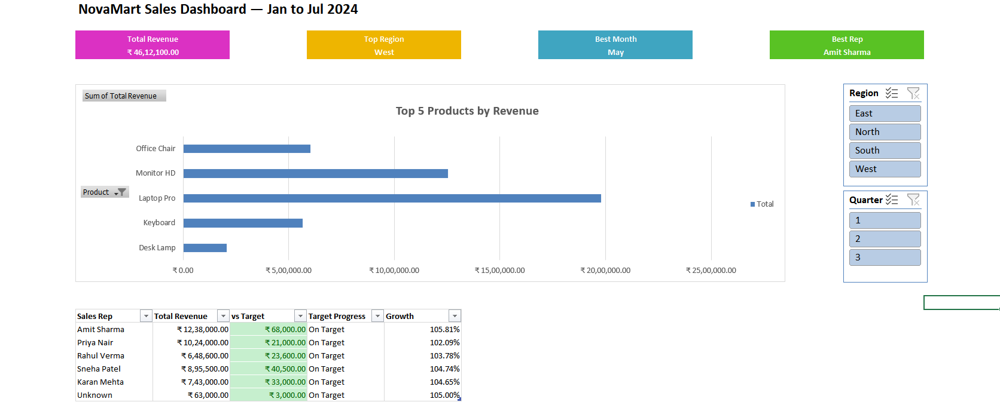

# NovaMart Sales Analysis, Excel

End-to-end sales analysis on a fictional NovaMart dataset covering data cleaning, aggregation, and an interactive dashboard.

## What I did
The dataset contained inconsistencies including mixed date formats and inconsistent casing, which were cleaned and standardised before analysis. Structured the data using Excel Tables and built aggregations using SUMIF, SUMIFS, and XLOOKUP formulas. Created dynamic Month, Quarter, and Year columns and a Summary sheet tracking regional revenue and sales rep performance against targets.

## What I found
- West region generated the highest revenue, with East recording the lowest
- Laptop Pro was the dominant product by revenue, significantly ahead of all other products
- May was the peak revenue month across the analysis period
- All sales representatives exceeded their targets, with Amit Sharma recording the highest total revenue
- North and West together accounted for the majority of total revenue

## What it suggests
Revenue is heavily concentrated in Laptop Pro. Expanding sales across other product lines would reduce dependence on a single product and make overall revenue more resilient.

## Tools
Microsoft Excel, SUMIF, SUMIFS, XLOOKUP, Pivot Tables

## Dashboard Preview

